<h1 align="center">Hi 👋, I'm Logic-Bin</h1>

  

  

---

<h3 align="center">🛠 Tech Stack</h3>

  
  
  
  
  
  
  
  

---

<h3 align="center">📊 GitHub Metrics</h3>

  

---

<h3 align="center">📈 GitHub Stats</h3>

  
  

---

<h3 align="center">🔥 Contribution Streak</h3>

  

---

<h3 align="center">📅 Contribution Calendar</h3>

  

---

<h3 align="center">🏆 GitHub Trophies</h3>

  

---

  <i>Keep coding, keep learning.</i>

